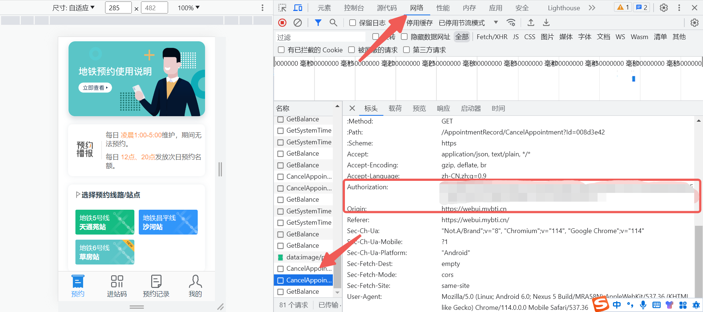
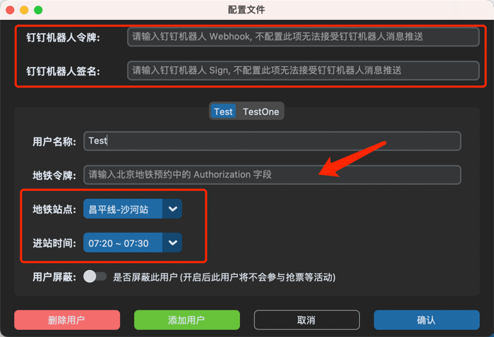

# 自动预约北京地铁进站服务

## 1. 简介

这是一个用于自动预约北京市地铁进站服务的程序，用户只需要设置好预约的线路、车站和预计进站时间等信息，程序就能够在预约开放时间内自动
完成进站预约申请，并在预约成功后发送通知，提醒用户到达地铁车站。

## 2. 使用说明

### 2.1 使用 APP (支持 Mac 和 Windows)
1. 下载软件:
   - 请根据您的PC平台下载对应的应用APP( Linux 用户请查看 [2.2 Server](#22-server-)准备工作 )。
2. 安装注意事项：
   - 在 Windows 系统上使用软件时，请确保不要将软件安装在C盘根目录下，否则需要以管理员方式运行软件。
3. 配置步骤
   - 打开下载的软件APP。
   - 
   - 登录[北京地铁预约页面](https://webui.mybti.cn/#/login)，并获取 Authorization 字段。该字段用于访问抢票所需的信息。
     1. 方法一
     
     2. 方法二
     
   - （可选）如果需要将抢票结果以钉钉消息的形式推送至钉钉群组，请配置钉钉的Webhook和Sign信息。
   - 选择抢票站点和时间。最多支持配置五个用户，且每个用户的名称不能为空（至少添加一个用户）。
      
   - 配置完成后，请保存设置。
4. 运行程序：
   - 确认配置已经保存，然后点击运行程序按钮。

5. 可选配置：
   - 钉钉消息推送：如果已经配置了钉钉信息，可以勾选此选项，抢票结果将以钉钉消息形式推送。
   - 日志等级：默认日志等级为INFO，您可以选择DEBUG查看详细日志。

### 2.2 Server 准备工作

如果你需要使用纯代码模式，需要完成以下准备工作：

1. 安装 Python3.9 及以上开发环境。
2. 安装程序所需要的依赖库：requests、click。可通过( `python setup.py install` )安装所有依赖
3. 打开 [北京地铁预约页面](https://webui.mybti.cn/#/login) 抓取接口 Headers 中的 authorization 字段内容
4. 配置 conf/conf.json 文件或者程序中指定自己的配置文件, 格式如下:
```json
{
  "dingTalkToken": "",
  "dingTalkSign": "",
  "userAgent": [
    {
      "lineName": "昌平线",
      "stationName": "沙河站",
      "timeSlot": "0720-0730",
      "name": "Coke",
      "mobile": "18888888888",
      "token": "EFGHZDBhMTEtMmM2MC00OGI2LTg3MGMtNjE3N2Q0NjlhNjIxLDE2MTA5NzE3MDUwOTIsTXFIeHlKb2JMRFovSTcrQnpPNFRkdXhzSTc4PQ=="
    },
    {
      "lineName": "昌平线",
      "stationName": "沙河站",
      "timeSlot": "0750-0800",
      "name": "CokeTwo",
      "mobile": "18888888888",
      "shakedown": true,
      "token": "EFGHZDBhMTEtMmM2MC00OGI2LTg3MGMtNjE3N2Q0NjlhNjIxLDE2MTA5NzE3MDUwOTIsTXFIeHlKb2JMRFovSTcrQnpPNFRkdXhzSTc4PQ=="
    }
  ]
}
```
```javascript
// 下列带有 * 的是必填参数, 如果未填写则无法通过校验
dingTalkToken = ""  // 钉钉机器人的 webhook
dingTalkSign = ""  // 钉钉机器人的加签密钥
UserAgent = []  // 需要抢票的用户列表
lineName = "昌平线"  // * 要抢票的线路, 可选值: 昌平线、5号线、6号线
stationName = "沙河站"  // * 要抢票的站点, 可选择: 沙河站、天通苑站、草房站
timeSlot = "0750-0800"  // * 抢票时段, 如早上6:30 ~ 6:40 则需要输入 0630-0640
name = "name"  // * 这是一个列表的 Key, 当存在多个抢票用户时, 可根据此 Key 来区分用户
mobile = "18888888888"  // 手机号, 预留字段, 可忽略
token = ""  // * token 对应了地铁预约程序的 authorization 字段
shakedown = false // 如果 shakedown 参数为 true 则忽略此用户, 此用户将不会参与抢票、验证及消息通知
```

### 2.3 运行程序

1. 打开控制台（Terminal）或命令行窗口。
2. 进入程序所在目录的 `subscribe-subway` 目录之中，并运行 `python subway/main.py` 命令。(可通过运行 `python subway/main.py --help` 命令查看所需参数)
3. 程序会在预约成功后发送钉钉通知，提醒用户到达地铁车站。

### 2.4 注意事项

- 本程序仅用于测试和学习目的，禁止用于商业用途。
- 请勿滥用进站预约服务，以免影响其他乘客的出行。
- 运行程序前请确认已经安装依赖库。
- 程序仅支持预约北京地铁5号线天通苑站、6号线草房站、昌平线沙河站，其他线路不在预约范围内。
- 如有需要，可以根据具体情况修改程序代码，但需要遵守相关法律法规和服务协议。

## 3. 结语

本程序是为方便用户自动预约北京市地铁进站服务而开发的，旨在提高出行效率，减少人员聚集，保障公共安全。用户需要遵守相关法律法规和服务协议，
合理使用进站预约服务，共同营造安全、文明、和谐的社会环境。
